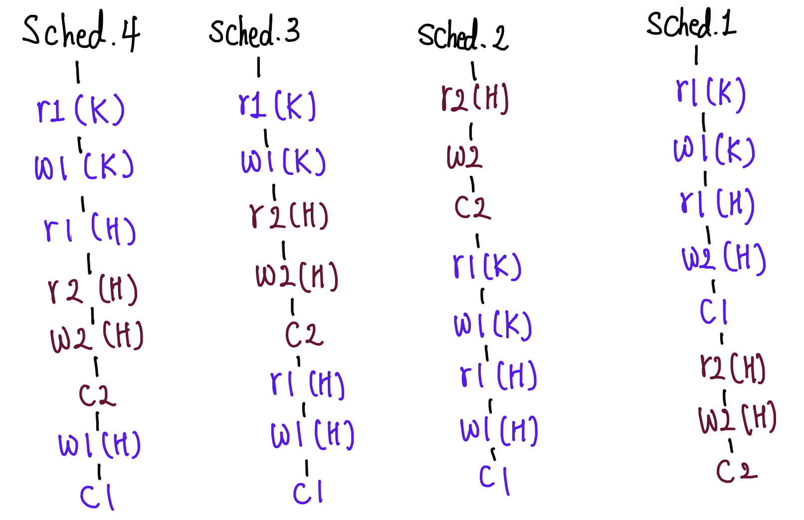

## Lost Update
#### Schedule
- 여러 transaction들이 동시에 실행될 때 각 transaction에 속한 operation들의 실행 순서
-  각 transaction 내의 operation들의 순서는 바뀌지 않는다
- 예시
	- K가 H에게 20만원을 이체할 때
	- H도 본인 계좌에 30만원 입금

	- sched1 && sched2: serial schedule
	- sched3 && sched4: nonserial(interleaving) schedule
- Nonserial Schedule의 성능
	- transaction 들이 겹쳐서 실행 -> 동시성 증가 -> 같은 시간 당 더 많은 transaction 처리가능
	- transaction들이 어떤 형태로 겹쳐서 실행되는지에 따라 이상한 결과가 나올 수 있음
#### Conflict
- 두 개의 operation에 대해
	- 서로 다른 transaction 소속이고,
	- 같은 데이터에 접근하며,
	- 하나 이상 write operation 일 때
- read-write conflict
	- sched.3: <r2(H), w1(H)>, <w2(H), r1(H)>
- write-write conflict
	- sched.3: <w2(H), w1(H)>
- conflict operation은 순서가 바뀌면 결과도 바뀜
#### Conflict Equivalent
- 두 schedule에 대해
	- 두 schedule은 같은 transaction을 가짐
	- 어떤 conflicting operations의 순서도 양쪽 schedule 모두 동일
- (e.g.) sched.3 && sched.2
	- serial schedule과 conflict equivalent 할 때 -> Conflict Serializable
#### View Equivalent

## 성능향상
#### 문제점
- 성능 때문에 nonserial schedule이 선호됨
- 하지만 이상한 결과(lost update 등)가 나오는 것은 바람직하지 않음
#### 해결책
- conflict equivalent한 nonserial schedule을 허용
#### 구현
- ~~여러 transaction이 실행될 대마다 해당 schedule이 conflict serializable한지 확인~~
	- 요청이 몰리면 검증에 대한 비용이 커짐
- 여러 transaction을 동시에 실행해도 schedule이 conflict serializable 하도록 보장하는 프로토콜 적용

## Concurrency Control
- 어떤 schedule도 serializable하게 만드는 것 -> Isolation
- 완벽한 isolation -> 성능을 제약함 -> isolation level로 통제할 수 있음
- 
---
참고
- [쉬운코드 - Youtube](https://www.youtube.com/watch?v=DwRN24nWbEc&list=PLcXyemr8ZeoT-_8yBc_p_lVwRRqUaN8ET&index=51)
