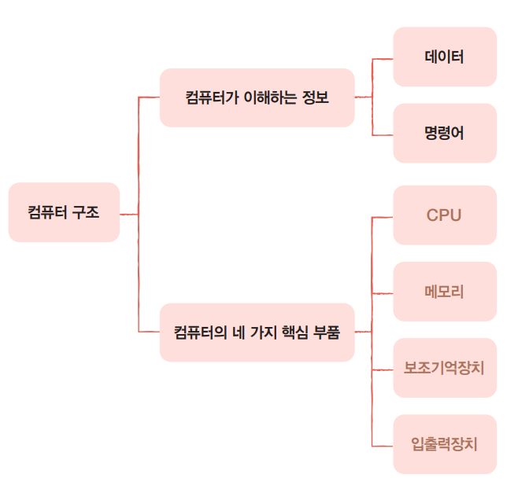
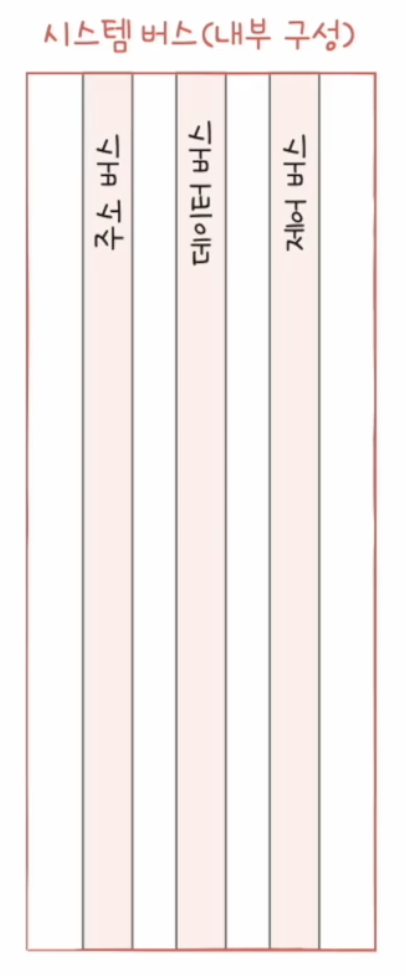

## 컴퓨터 구성
- 컴퓨터 구조
    

- 데이터 흐름
    

    - 메인보드
        - 컴퓨터의 각 부품에 전원 공급 및 부품 간 신호 전달 통로
        - motherboard, system board 등으로 불림

    - 메모리
        - 프로세스: 현재 실행되는 프로그램 (운영체제로부터 자원을 할당받은 작업의 단위)
        - 프로세스의 명령어와 데이터를 저장하는 부품
        - 주소

    - CPU
        - Central Processing Unit
        - 성능은 clock 속도와 코어 수로 결정된다
        - 기억, 해석, 연산, 제어를 관리하는 장치
        - 외부에서 정보 입력 -> 기억 -> 연산 -> 결과 출력
            - fetch: 메모리에서 명령어 불러오기. 프로그램 내부의 명령어 위치(주소)
            - decode: 명령어 해독 후 명령어 내의 데이터 정보와 연산 정보 추출 후 각 장치에 적절한 제어신호를 보내 연산 및 처리에 대한 준비
            - execute: 실제 연산. 결과는 다음 명령어에서 사용 여부에 따라 memory 단계 혹은 write-back 단계로 갈 지 결정됨
            - memory: 연산결과가 다음 명령어에 바로 사용되지 않을 때 메모리에 저장하는 것
            - write-back: 계산 결과를 register에 다시 쓰는 것
        - processor register: 명령어 저장
        - ALU (Arithmetic Logic Unit): 비교, 판단, 연산
        - control unit: 명령어 해석 및 올바른 실행을 위한 CPU 내부 제어
        - register: CPU 내부의 작은 저장장치
    
    - System Bus
        
        