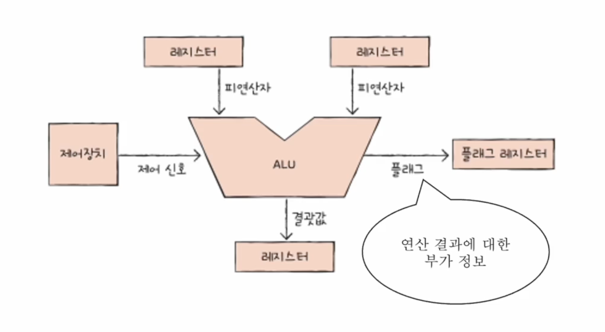
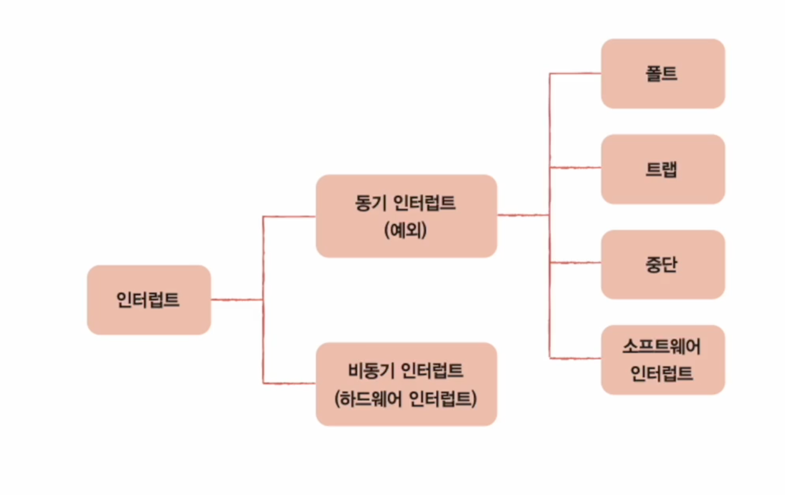
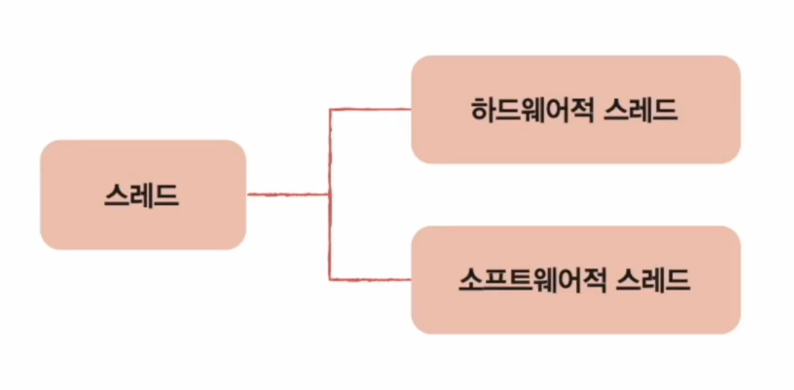
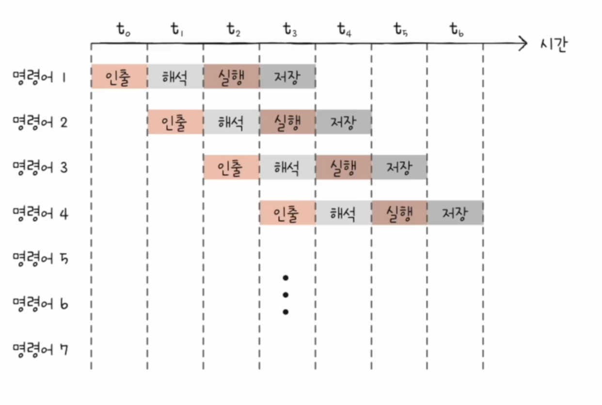

## CPU 작동 원리
### ALU와 제어장치

- 플래그
    - 부호: 양수 / 음수 (1: 음수 / 0: 양수)
    - 제로: 연산 결과가 0인지 여부 
    - 캐리: 올림수나 빌림수가 발행한 여부
    - 오버플로우
    - 인터럽트: 인터럽트 가능 여부
    - 슈퍼바이저: 커널 모드 or 사용자 모드 여부 (1: 커널 / 0: 사용자)

- 제어장치
    - 받아들이는 정보
        - 클럭 신호: 컴퓨터의 모든 부품을 일사불란하게 움직일 수 있게 하는 시간 단위
        - 해석할 명령어: 명령어 레지스터로부터 가져옴
        - 플래그
        - 제어신호 (입출력 장치 등)
    - 내보내는 정보 == 제어신호 -> 제어버스
        - CPU 내부
            - 레지스터
            - ALU
        - CPU 외부
            - 메모리
            - 입출력장치

### 레지스터
- 프로그램 카운터: 메모리에서 **가져올** 명령어의 주소 (**다음으로 실행할** 명령어)
- 명령어 레지스터: 해석할 명령어
- 메모리 주소 레지스터: 메모리의 주소 (프로그램 카운터에서 받아옴)
- 메모리 버퍼 레지스터: 메모리와 주고받을 값(데이터, 명령어)
>> 보통의 경우 프로그램 카운터가 증가하며 순차적으로 실행됨  
>> -> 하지만 JUMP 등의 명령어 or 인터럽트 될 경우가 있어 무조건 적으로 순차적인 진행이 되는 것은 아님

- 플래그 레지스터: 연산 결과 or CPU 상태에 대한 부가 정보
- 범용 레지스터: 다양하고 일반적인 상황에서 자유롭게 사용
- 스택 포인터: 스택의 꼭대기를 가리키는 레지스터 (어디까지 차 있는지)
    - 스택 주소 지정 방식에서 사용
    - 메모리 내의 스택 영역
- 베이스 레지스터: 기준 주소
    - 변위 주소 지정 방식: operand 필드 값 (변위) + 특정 레지스터 값 = 유효 주소
        - 상대 주소 지정 방식: operand field + programme counter
        - 베이스 레지스터 주소 지정 방식: operand field + base register
>> 메모리 주소 != CPU가 인식하는 주소

### 명령어 사이클과 인터럽트
- 인출 사이클: 메모리 -> CPU register
- 실행 사이클: 실행
- 간접 사이클: 인출 후 메모리 접근이 더 필요한 경우   
- 인터럽트
    
    - 동기 인터럽트 (exception): CPU가 예기치 못한 상황 발생
    - 비동기 인터럽트 (하드웨어 인터럽트): 주로 입출력장치에 의해 발생
        1. 입출력장치 -> CPU 인터럽트 요청 신호
        2. CPU는 실행 사이클이 끝나고 명렁어 인출 전 항상 인터럽트 여부 확인
        3. 인터럽트 플래그를 통해 현재 받아들일 수 있는 지 여부 판단
        4. 받아들일 수 있다면 CPU는 지금까지 작업 백업
        5. CPU는 인터럽트 벡터를 참조하여 인터럽트 서비스 루틴 실행
        6. 루틴 실행 후 백업 작업 복구 뒤 실행
    >> 인터럽트 서비스 루틴: 인터럽트 처리하는 프로그램
    >> 인터럽트 벡터: 인터럽트 서비스 루틴 시작 주소 (인터럽트를 구분하기 위한 정보)
    >> CPU 작업 백업 -> 메모리 스택 영역
---

## CPU 성능 향상 기법
### 빠른 CPU를 위한 설계 기법
- 스레드 (thread)
    
    - 하드웨어 스레드: 하나의 코어가 동시에 처리하는 명령어 단위
    - 소프트웨어 스레드: 하나의 프로그램에서 독립적으로 실행되는 단위

### 명령어 병렬 처리 기법
- 명령어 파이프라인
    - 명령어 인출 (Instruction Fetch)
    - 명령어 해석 (Instruction Decode)
    - 명령어 실행 (Execute Intruction)
    - 결과 저장 (Write Back)   

    - 같은 단계가 겹치지 않는다면 CPU는 각 단계를 동시에 실행할 수 있다
        

### 명령어 집합구조 CISC와 RISC
