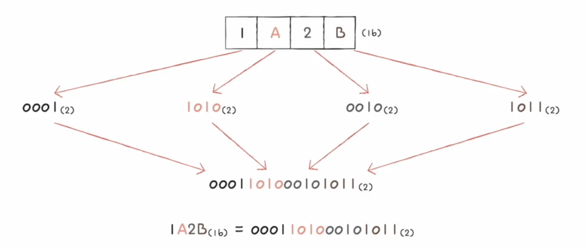
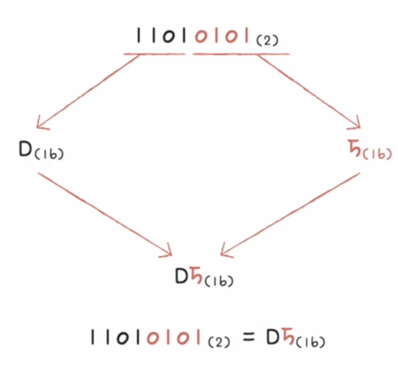

## 숫자를 표현하는 법
### 비트(bit): 0과 1을 표현하는 가장 작은 정보 단위
- n개의 비트로 2^n가지의 정보 표현 가능
- 1byte = 8bit
- 1kB = 1000byte
- 1MB = 1000kB
- 1GB = 1000MB
- 1TB = 1000GB

### 워드 (word) 
- CPU가 한번에 처리할 수 있는 정보의 크기
- 하프 워드 / 풀 워드 / 더불 워드

### binary
- 표기법 (8)
    - 1000(2)
    - 0b1000
- 음수 표기
    - 2의 보수법
    - 어떤 수를 그보다 큰 2n에서 뺀 값
        - 11(2)보다 큰 2n=100(2)  
            -> 100(2) - 11(2) = 01(2) 
    - 모든 0과 1을 뒤집고 1 더한 값
    - CPU의 flag register로 음수와 양수 판별

### hexadecimal
- 표기법
십진수    0 1 2 3 4 5 6 7 8 9 10 11 12 13 14 15 16  17 ...
십육진수  0 1 2 3 4 5 6 7 8 9  A  B  C  D  E  F  10 11 ...
- 15 표기
    - 15(16)
    - 0x15
- hexadecimal -> binary
    -  hexadecimal의 각 자리 수를 4자리 binary로 표기
    
    - binary 수의 4자리 씩 끊어서 hexadecimal로 표기
    
---
## 문자를 표현하는 법
### 문자 집합과 인코딩
- 문자 집합(character set): 컴퓨터가 이해할 수 있는 문자의 모음
- encoding: 문자를 0과 1로 이루어진 문자 코드로 변환하는 과정
- decoding: 0과 1로 표현된 문자 코드를 문자로 변환하는 과정