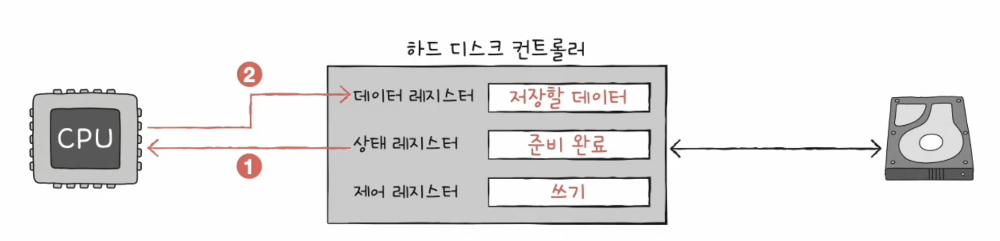
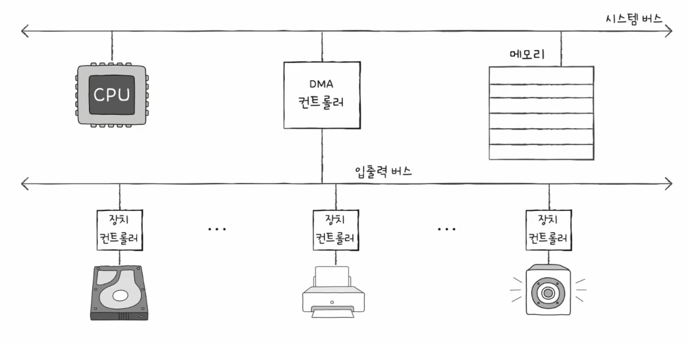

## Device Controller
- CPU - IO Device 간의 통신 중계
- 오류 검출
- 데이터 버퍼링
    > 버퍼링: 전송률이 높은 장치와 낮은 장치 사이에 주고받는 데이터를<br/> 
    > *버퍼*라는 임시 저장 공간에 저장하여 전송률을 비슷하게 맞추는 방법

- 데이터 레지스터
    - CPU와 입출력장치 사이에 주고받을 데이터가 담기는 레지스터 (버퍼)
    - RAM을 사용하기도 함
- 상태 레지스터
    - 상태 정보 저장
        - 입출력 장치가 입출력 할 준비가 되었는지
        - 작업이 완료 되었는지
        - 장치에 오류가 없는 지 등의 상태 정보
- 제어 레지스터
    - 장치가 수행할 내용에 대한 제어 정보

### 장치 드라이버
- 장치 컨트롤러의 동작을 감지하고 제어하는 프로그램
    - 장치 컨트롤러가 하드웨어적이라면,
    - 장치 드라이버 소프트웨어적
    - 장치 드라이버를 인식하고 실행하는 주체는 **운영체제**
---
## Various IO methods
### 프로그램 입출력
- 프로그램 속 명령어로 입출력장치를 제어하는 방법
- 메모리에 저장된 정보를 하드 디스크에 백업 (하드 디스크에 새로운 정보 *쓰기*)

1. CPU는 하드 디스크 컨트롤러의 제어 레지스터에 쓰기 명령 내보냄
2. 하드 디스크 컨트롤러는 하드 디스크 상태 확인 -> 상태 레지스터에 준비 완료 표시
3. 1) CPU는 상태 레지스터를 주기적으로 읽어보며 하드 디스크의 준비 여부 확인
    2) 준비 완료 시 백업할 메모리의 정보를 데이터 레지스터에 쓰기
>> 프로그램 입출력 방식: <br/>
>> CPU가 장치 컨트롤러의 레지스터 값을 읽고 씀으로써 이루어짐

- 레지스터를 인식하는 방법
    - 메모리 맵 입출력
        
        - 메모리에 접근하기 위한 주소 공간 && 입출력장치에 접근하기 위한 주소 공간 -> 하나의 주소 공간으로 간주
        - 전체가 메모리인 것 처럼
    - 고립형 입출력
        
        - 메모리의 주소 공간과 입출력 장치 주소 공간을 분리
        - 입출력 전용 명령어(읽기/쓰기) 사용

### 인터럽트 기반 입출력

- 우선순위를 반영한 인터럽트
    
    - NMI: Non-maskable Interrupt
    - 플래그 레지스터 속 인터럽트 비트를 활성화한 채 인터럽트 처리
    - PIC (Programmable Interrupt Controller)
        
        - 여러 장치 컨트롤러에 연결되어
        - 장치 컨트롤러의 하드웨어 인터럽트의 우선순위를 판단한 뒤
        - CPU에게 지금 처리해야 하는 인터럽트가 무엇인지 판단하는 하드웨어
        - 하드웨어의 우선순위만 판단 (NMI 우선순위까지 판단하지는 않음)
        <br/><br/>
> 프로그램 입출력 && 인터럽트 기반 입출력<br/>
>> 입출력장치와 메모리 간의 데이터 이동은 **CPU가 주도**<br/>
>> 이동하는 데이터도 반드시 **CPU를 거침**

### DMA 입출력
- DMA: Direct Memory Access
- CPU를 거치지 않고 입출력장치가 메모리에 직접적으로 접근하는 기능
```
1. CPU -> DMA Controller 입출력 작업 명령
2. DMA Controller는 CPU 대신 장치 컨트롤러와 상호작용하며 입출력 작업 수행 (필요시 메모리에 직접 접근)
3. 입출력 끝나면 DMA controller는 인터럽트를 통해 CPU에 작업이 끝났음을 알림
```
- CPU는 작업의 시작과 끝에만 관여
- DMA는 시스템 버스를 이용
    - 시스템 버스는 공용 자원 -> 동시 사용 불가능
    - CPU가 시스템 버스 사용 시 DMA 컨트롤러는 사용 불가능
    - 반대 경우도 마찬가지

> 1. CPU가 시스템 버스를 이용하지 않을 때마다 조금씩 시스템 버스 이용
> 2. CPU가 일시적으로 시스템 버스를 이용하지 않도록 허락을 구하고(request) 시스템 버스 이용

- 입출력 버스
    - 시스템 버스의 빈번한 사용 방지
    
    - PCI 버스, PCI express(PCIe) 버스와 입출력 장치를 연결짓는 슬롯