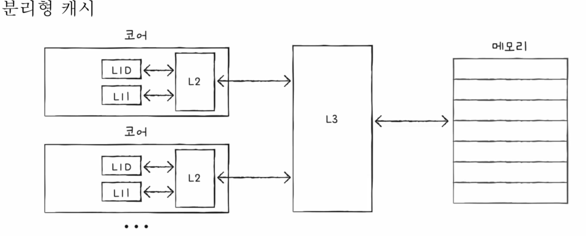

## RAM의 특징과 종류
### RAM의 종류
- DRAM: Dynamic RAM
    - 저장된 데이터가 동적으로 사라짐
    - 전원에 연결되어 있어도 데이터가 사라짐
    - 데이터의 소멸을 막기위해 주기적으로 재활성화 필요
    - `일반적으로 사용됨 => 상대적으로 소비전력이 낮고 집적도가 높아 대용량 설계 용이`
- SRAM: Static RAM
    - 전원 연결 시 데이터가 사라지지 않음
    - `캐시 메모리에 사용됨 => 상대적으로 소비전력 높고 가격 높고 집적도 낮음 -> 대용량이 필요없고 빨라야하는 장치에 사용`
- SDRAM: Synchronous DRAM
    - 클럭 신호와 동기화된 DRAM
    - SDR (Single Data Rate)
- DDR SDRAM: Double Data Rate SDRAM
    - 가장 대중적으로 사용하는 RAM
    - 대역폭을 넓혀 속도를 빠르게 만든 SDRAM
    - DDR2 SDRAM v. DDR3 SDRAM v. DDR4 SDRAM -> 2배 씩 대역폭이 넗어짐 (2, 4, 8, 16)

---
## 메모리의 주소 공간
### 물리 주소와 논리 주소
CPU와 프로그램은 어떤 메모리 주소에 무엇이 저장되어 있는지 다 알수 없음
> - 메모리에 저장된 값들은 계속 변함
> - 새로운 프로그램 -> 새롭게 메모리에 적재
> - 종료된 프로그램 -> 메모리에서 삭제
> - 같은 프로그램 실행 할 때마다 적재되는 주소 변화

#### 물리 주소
- 메모리의 주소 (하드웨어 상의 주소)

#### 논리 주소
- CPU 와 실행 중인 프로그램 입장에서 바라본 주소
- 실행 중인 프로그램 각각에게 부여된 0번지 부터 시작하는 주소
- 여러 겹치는 주소가 있을 수 있음

### 물리 주소와 논리 주소의 변환
MMU (Memory Management Unit, 메모리 관리 장치)에 의해 변환
- 논리 주소와 베이스 레지스터 값을 더하여 논리 주소 -> 물리 주소 변환
    - 베이스 레지스터: 물리 주소 상의 프로그램의 시작 주소 (프로그램의 기준 주소)
    - e.g) 프로그램 A의 100번지 데이터 삭제 -> 프로그램 A(베이스 레지스터 값)의 100번지(논리주소 100) -> 물리주소(베이스 레지스터+100)

### 메모리 보호
한계 레지스터
- 프로그램의 영역을 침범할 수 있는 명령어의 실행을 막음 (다른 프로그램에 명령 실행할 수 없음)
- *논리 주소*의 가장 큰 값을 저장 (v. 베이스 레지스터 (*물리주소* 최솟값을 저장))
- 베이스 레지스터 <= 프로그램 **물리 주소** 범위 <= 베이스 레지스터 + 한계 레지스터

---
## 캐시 메모리
- CPU와 메모리 사이에 위치한 (레지스터보다 용량 크고 메모리보다 빠른) SRAM 기반의 저장 장치
- CPU 연산 속도와 메모리 접근 속도 차이를 줄이기 위해 탄생
- 메모리에서 CPU가 사용할 일부 데이터를 미리 캐시 메모리로 가져와 사용

- 계층적 캐시 메모리 (L1 - L2 - L3)

- 참조 지역성의 원리
    - 캐시 메모리는 메모리의 모든 내용을 저장할 수 없음
    - CPU가 자주 사용할 법한 내용을 *예측하여* 저장
    - 예측이 들어맞을 경우 == 캐시 히트
    - 캐시 적중률 `캐시 히트 횟수 / (캐시 히트 횟수 + 캐시 미스 횟수)`
    >> 1. CPU는 최근에 접근했던 메모리 공간에 다시 접근하려는 경향이 있다.
    >> 2. CPU는 접근한 메모리 공간 근처를 접근하려는 경향이 있다. (공간 지역성)

