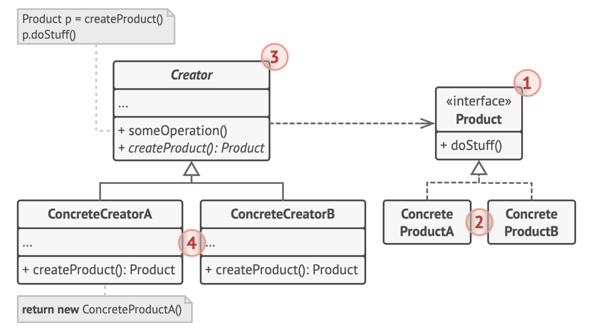

## Creational Patterns
> 유연성을 증가시키고 이미 존재하는 코드의 재사용성을 높이는 객체 생성 매커니즘
#### Factory Method
- 부모 클래스에서 **객체를 생성**하는 인터페이스를 제공하면서 
- 자식 클래스에서 생성되는 객체를 변화시킬 수 있게 하는 생성 패턴
- 구조

```java
// Product interface
interface Vehicle {
    void drive();
}

// Concrete products
class Car implements Vehicle {
    @Override
    public void drive() {
        System.out.println("Driving a car");
    }
}

class Motorcycle implements Vehicle {
    @Override
    public void drive() {
        System.out.println("Riding a motorcycle");
    }
}

// Creator interface with default method 
interface VehicleFactory { 
	// Factory method 
	Vehicle createVehicle();
	// Default method
	default void deliverVehicle() { 
		Vehicle vehicle = createVehicle();
		vehicle.drive();
		}
}

// Concrete creators
class CarFactory extends VehicleFactory {
    @Override
    Vehicle createVehicle() {
        return new Car();
    }
}


class MotorcycleFactory extends VehicleFactory {
    @Override
    Vehicle createVehicle() {
        return new Motorcycle();
    }
}

// Client code
public class Main {
    public static void main(String[] args) {
        VehicleFactory carFactory = new CarFactory();
        carFactory.deliver
```
- 또 다른 예시
```java

// Product interface
interface Pizza {
    void prepare();
    void bake();
    void cut();
    void box();
}

// Concrete products
class MargheritaPizza implements Pizza {
    @Override
    public void prepare() {
        System.out.println("Preparing Margherita: Adding tomato sauce and mozzarella");
    }

    @Override
    public void bake() {
        System.out.println("Baking Margherita for 15 minutes at 200°C");
    }

    @Override
    public void cut() {
        System.out.println("Cutting Margherita into 8 slices");
    }

    @Override
    public void box() {
        System.out.println("Boxing Margherita pizza");
    }
}

class PepperoniPizza implements Pizza {
    @Override
    public void prepare() {
        System.out.println("Preparing Pepperoni: Adding tomato sauce, mozzarella, and pepperoni");
    }

    @Override
    public void bake() {
        System.out.println("Baking Pepperoni for 18 minutes at 190°C");
    }

    @Override
    public void cut() {
        System.out.println("Cutting Pepperoni into 8 slices");
    }

    @Override
    public void box() {
        System.out.println("Boxing Pepperoni pizza");
    }
}

// Creator interface with default method
interface PizzaFactory {
    Pizza createPizza();
    
    default void orderPizza() {
        Pizza pizza = createPizza();
        pizza.prepare();
        pizza.bake();
        pizza.cut();
        pizza.box();
        System.out.println("Pizza is ready!\n");
    }
}

// Concrete creators
class MargheritaPizzaFactory implements PizzaFactory {
    @Override
    public Pizza createPizza() {
        return new MargheritaPizza();
    }
}

class PepperoniPizzaFactory implements PizzaFactory {
    @Override
    public Pizza createPizza() {
        return new PepperoniPizza();
    }
}

// Pizza store using the factory
class PizzaStore {
    private PizzaFactory factory;

    public PizzaStore(PizzaFactory factory) {
        this.factory = factory;
    }

    public void orderPizza() {
        factory.orderPizza();
    }
}

// Client code
public class Main {
    public static void main(String[] args) {
        PizzaStore margheritaStore = new PizzaStore(new MargheritaPizzaFactory());
        PizzaStore pepperoniStore = new PizzaStore(new PepperoniPizzaFactory());

        System.out.println("Ordering Margherita:");
        margheritaStore.orderPizza();

        System.out.println("Ordering Pepperoni:");
        pepperoniStore.orderPizza();
    }
}
```
#### Abstract Factory
- 관련 객체들의 구상 클래스 (concrete class)를 지정하지 않고 관련 객체들의 모음을 생성 할 수 있도록 하는 생성 패턴

#### Builder

#### Singleton

#### Prototype

## Structural Patterns
> 객체와 클래스를 더 큰 구조로 구성하는 법
#### Adapter

#### Bridge

#### Composite

#### Decorator

#### Facade

#### Flyweight

#### Proxy

참고
[Refactoring Guru](https://refactoring.guru/design-patterns/catalog)