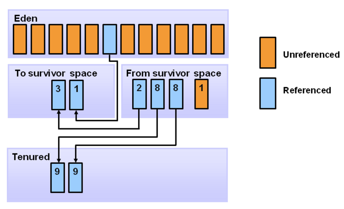
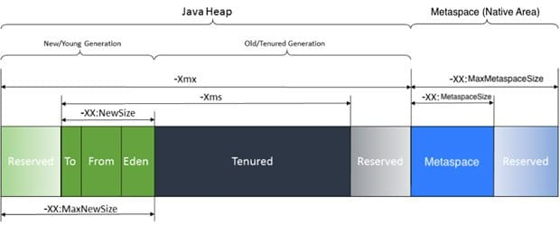

## Garbage Collection
- GC의 대상이 되는 경우
  - 객체가 null (e.g. String str = null)
  - 블럭 실행 종료 후, 블럭 안에서 생성된 객체
  - 부모 객체가 null인 경우, 포함하는 자식 객체

### Stop the World
- GC를 실행하기 위해 JVM이 어플리케이션 실행을 멈추는 것
- GC를 실행하는 thread를 제외한 나머지 thread는 모두 작업을 중지
- GC 작업 완료 후 중단했던 작업을 다시 시작  
`어떤 GC 알고리즘을 사용해도 stop-the-world는 발생. 대게 GC 튜닝은 이 시간을 줄이는 것`

### Mark and Sweep
- mark: 사용되는 메모리와 사용되지 않는 메모리 식별
- sweep: 사용되지 않는다고 식별된 메모리 해제

### Weak Generational Hypothesis
1. 대부분의 객체는 금방 접근 불가능 상태 (unreachable)가 된다
2. 오래된 객체에서 젊은 객체로의 참조는 아주 드물게 존재한다

### Young Generation
- 새롭게 생성된 객체의 대부분이 위치
- 대부분의 객체가 금방 unreachable하기 때문에 Young 영역에서 생성 후 소멸
- Minor GC
- Eden 영역 (1개)
- Survivor 영역 (2개)
  - Eden 영역에서 GC 발생 후 살아남은 객체는 Survivor 영역 중 하나로 이동
  - 다음부터는 객체가 존재하는 Survivor 영역으로 객체가 계속 쌓임
  - 하나의 Survivor 영역이 가득 차면, 그 중 살아남은 객체를 다른 Survivor 영역으로 이동
  - 다른 영역으로 이동 시 기존 영역은 아무 데이터가 없는 상태
  - 이 과정을 반복하고, 계속 살아있는 객체는 Old Generation으로 이동
  - `Survivor 영역 중 하나는 반드시 비어 있는 상태로 남아있어야 함`

### Old Generation 
- reachable 상태로, Young 영역에서 살아남은 객체가 Old로 복사됨. 
- 대부분 Young 영역보다 크게 할당 -> GC 적게 발생. 
- 객체가 사라질 때 Major GC (Full GC) 

### Permanent Generation (Deprecated)
- JVM이 클래스들과 메소드들을 설명하기 위해 필요한 메타 데이터
- 상수 풀 정보 데이터
- JVM, JIT 관련 데이터
- Permanent Heap 영역에 저장됨
  - `-Xms`, `Xmx`로 사이즈 조정
- JDK8부터 Metaspace로 교체됨

### Metaspace
- Native Memory에 대부분 정보 저장
  - class meta data
  - method meta data
  - etc..
- Heap 메모리에 저장
  - Static Object (변수, 상수)
  - interned String
- Native Memory는 OS단에서 관리하므로 메모리 크기를 신경쓰지 않아도 됨

---
### 참조
- [GC Overview (naverD2)](https://d2.naver.com/helloworld/1329)
- [PermGen v. Metaspace (John Grib github)](https://johngrib.github.io/wiki/java8-why-permgen-removed/)