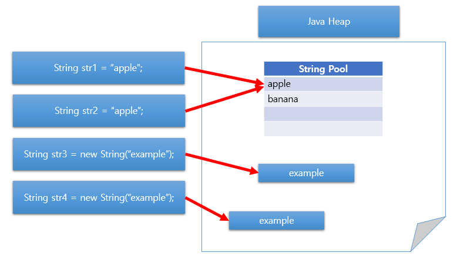

## Primitive Type & Reference Tpye

### Classification
```
Java Data Type 
ㄴ Primitive Type
    ㄴ Boolean Type(boolean)
    ㄴ Numeric Type
        ㄴ Integral Type
            ㄴ Integer Type(short, int, long)
            ㄴ Floating Point Type(float, double)
        ㄴ Character Type(char)
ㄴ Reference Type
    ㄴ Class Type
    ㄴ Interface Type
    ㄴ Array Type
    ㄴ Enum Type
    ㄴ etc.
```

### Primitive Type (기본형 타입)
- 사용되기 전 declared(선언) 되어야 함
- OS에 따라 자료형의 길이가 변하지 않음
- *비객체* 타입 -> null 값 가질 수 없음 -> Wrapper Class는 null 값 가능
- Stack 메모리에 저장됨
- Call by Value 형태로 대상에 주소값을 가지지 않음
- 8가지 종류
  - boolean, char, byte, short, int, long, float, double

### Reference Type (참조형 타입)
- Primitive Type을 제외한 모든 타입
- java.lang.Object 클래스를 상속하는 모든 클래스
- Call by Reference 형태로 생성시 주소값 부여
- Null 존재 (문법적 오류 x). Runtime Error -> NullPointException 발생


### String Class
- Reference Type이지만 Primitive Type 처럼 사용
- immutable object -> 값 변경 method들은 새로운 String class Object를 만드는 것
- 비교 시 `==`연산자가 아닌 `.equals()` 메소드 사용

> `==` 연산자와 `.equals()`차이
> - == 연산은 비교하는 대상의 주소값 비교
> - equals 메소드는 비교하는 대상의 값 자체 비교<br/>
> - String class를 literal로 선언 시 내부적으로 intern()메서드 호출
>   - intern()메소드는 문자열이 string constant pool에 존재하는지 확인 후 존재 시 해당 주소값을 반환, 없다면 string constant pool에 넣고 새로운 주소값 반환
> 

```java
public class compare {
    public static void main(String[] args) {
        // literal로 선언
        String s1 = "abcd";
        // new 연산자 선언
        String s2 = new String("abcd");

        if (s1 == s2) {
            System.out.println("값이 같습니다");
        } else {
            System.out.println("값이 다릅니다");
        }
        if (s1.equals(s2)) {
            System.out.println("값이 같습니다");
        }
         else {
            System.out.println("값이 다릅니다");
        }
    }
}
// 값이 다릅니다
// 값이 같습니다
```