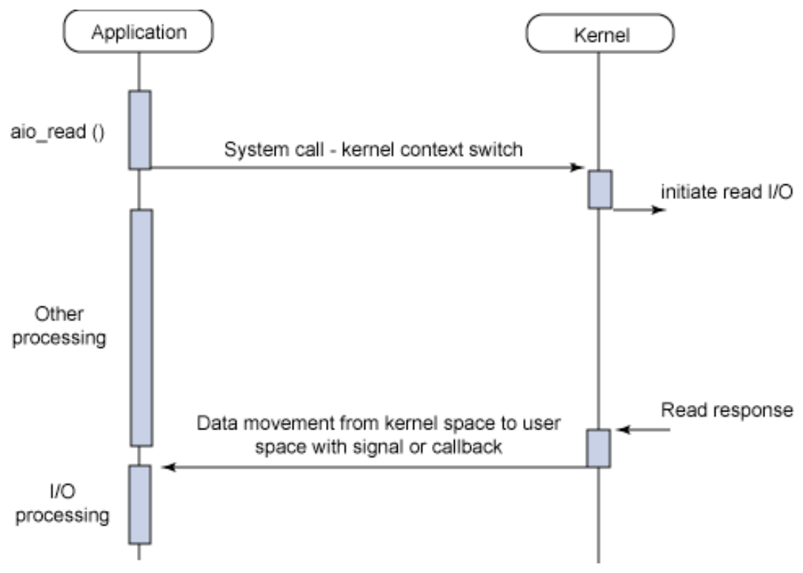

## OSI 7 Layers
Open Systems Interconnection Reference Model<br/>
각 계층은 하위 계층의 기능만을 이용하고 상위 계층에게 기능을 제공<br/>

>> 물리적 연결: 케이블을 통해 직접적으로 연결되는 통신  
논리적 연결: IP 또는 MAC address를 통한 통신  

>> 물리적 주소: MAC address -> 변경 불가능 (고유값)  
논리적 주소: IP, IPX, Apple talk -> 변경 가능

PDNTSPA

1. Physical Layer (물리계층) <br/>
데이터 전달 역할 수행 <br/>
장치: 케이블, 리피터, 허브

2. Data Link Layer (데이터 링크 계층)<br/>
- 물리적 연결을 통한 인접한 두 장치간 의 신뢰성 있는 정보 전송을 담당
- 물리 계층에서 

---
## [TCP] 3 way handshake & 4 way handshake

- State 정보
    - closed: 포트가 닫힌 상태
    - listen: 포트가 열린 상태 && 연결 요청 대기중
    - syn-recv: SYN 요청 받고 상대방 응답 대기중
    - established: 포트 연결 상태
    - time-wait: server로 부터 fin을 수신하더라도 일정시간(default: 240sec) 동안 세션을 남겨놓고 잉여 패킷을 기다리는 과정

- Flag 정보
    - SYN: connection을 생성할 때 사용
    - ACK: 응답확인. 패킷 수신 flag
    - FIN: 연결 해제 (4way handshake)

### 3 way handshake - 연결
- TCP 통신을 이용하여 데이터를 전송하기 위해 네트워크 연결을 설정하는 과정 (Connection Establish)  
- 정확한 전송을 보장하기 위해 상대 컴퓨터와 사전에 세션을 수립하는 과정


- SYN (synchronize): 연결요청 메시지
    - seq(sequence number): 임의의 랜덤한 숫자

- ACK (Acknowledgement): 연결 성공 메시지
    - seq + 1

### 4 way handshake - 해제
- 세션을 종료하기 위해 수행되는 절차  
  

>> == 연결 과정과 종료 과정 단계가 차이 나는 이유 ==  
client가 데이터 전송을 마쳐도 server에서 보낼 데이터가 남아있을 수 있음.  
-> server는 fin에 대한 ack를 먼저 보내고 데이터를 모두 전송한 후 client에게 fin메시지를 보낸다

>> == server가 fin플래그를 전송하기 전에 전송한 패킷이 routing 지연이나 패킷 유실로 인한 재전송 등으로 인해 fin 패킷보다 늦게 도착하는 상황 ==  
time-wait -> client는 server로부터 fin 플래그를 수신하더라도 일정시간 동안 세션을 유지하여 잉여 패킷을 기다리는 과정을 거침

>> == sequence number를 난수로 생성하여 설정하는 이유 ==  
connection에 사용하는 port는 유한 범위 내에서 사용하고 시간이 지남에 따라 재사용 됨 -> 과거에 사용된 포트 번호 쌍을 사용할 가능성 존재  
-> 순차적 number가 전송되면 이전 connection으로부터 오는 패킷으로 인식할 수 있음


## TCP 흐름제어 / 혼잡제어
### TCP 통신의 기본 개념
- reliable network를 보장하는 프로토콜
    - 손실: packet이 손실될 수 있음
    - 순서 바뀜: packet의 순서가 바뀔 수 있음
    - 혼잡: 네트워크가 congested할 수 있음
    - 과부하: receiver가 overload 될 수 있음
- network congestion avoidance algorithm 사용

- 흐름제어
    - 송신측과 수신측의 데이터 처리 속도 차이를 해결하기 위한 기법
    - receiver가 패밋을 지나치게 많이 받지 않도록 조절
    - receiver가 sender에게 현재 자신의 상태를 feedback
- 혼잡제어
    - sender의 데이터 전달과 네트워크 데이터 처리 속도 차이를 해결하기 위한 기법

- 전송 과정
    - Application Layer에서 sender application은 socket에 데이터 기록
    - Transportation Layer에서 데이터는 segment로 나뉨
    - Network Layer에서 segment를 받음
    - 전송된 데이터는 receiver의 receive buffer에 저장
        - receive buffer 용량 manage 해야함
    - receiver는 receive window를 sender에게 전달
        - receive window: receive buffer 용량 상태
    - sender는 receive window 모니터링 하면서 데이터 전송

- 흐름제어 방법
    - Stop and Wait: 매번 전송한 패킷에 대해 확인 응답 받은 후 다음 패킷 전송
    - Sliding Window: receive window만큼 sender가 segment 전송하여 데이터 흐름을 동적으로 조절
        - 전송은 되었지만 ACK 못받은 byte 숫자를 파악하기 위해 사용
        - (LastByteSent) - (LastByteACKed) <= (ReceiveWindowAdvertised)

---
## UDP
### UDP 통신의 개념
- User Datagram Protocol, 데이터를 데이트그램 단위로 처리하는 프로토콜 -> Transportation Layer
- 비연결성, 비신뢰성 전송 프로토콜

### TCP / UDP 배경
- IP: Internet Protocol
    - 송신 호스트와 수신 호스트가 패킷 교환 네트워크(Packet Switching Network)에서 정보를 주고받는 데 사용하는 정보 위주의 규약  
    - Network Layer에서 호스트의 주소지정과 패킷 분할 및 조립 기능 수행
    - 비신뢰성: 흐름에 관여하지 않음 -> 전송된 정보가 제대로 도착했는지 보장하지 않음 (패킷 손상, 누락, 중복, 순서 바뀜 등)
    - 비연결성: 송신자와 수신자가 서로 연결될 필요가 없음 -> 수신자의 상태 (기기의 사용불가 상태 등)에 상관없이 데이터를 보낼 수 있음  <br/><br/>
    >> 비신뢰성 && 비연결성 -> 통신 속도 확보

    - 한계
        - Host to Host (장치 간) 연결만 지원
            - 하나의 장비 안에서 수많은 프로그램들이 통신할 때 한계
            - 포트 번호 부여
        - 오류 발생 시 대처할 수 없음
            - ICMP
                - Internet Control Messsage Protocol
                - 네트워크 내 장치가 데이터 전송과 관련된 문제를 전달
                - 데이터가 대상에 도달하는지 && 도달 시간이 적절한 지 확인
                - **오류 보고** 프로세스 및 테스트의 중요한 측면
                - DDoS 실행에 이용될 수 있음에 주의
                - TCP or UDP 와 같은 Transportation Layer와 연결되지 않음
                - 장치의 특정 포트를 대상으로 하는 것을 허용하지 않음
    
    - 해결방안
        - TCP: 데이터 분실, 중복, 순서 바뀜을 보정
        - UDP: 에러 및 재전송 가능성 -> Application Layer에서 처리
    
    - UDP 사용 이유
        - 신속성 -> 데이터의 처리가 빠름
        - 실시간 방송 및 온라인 게임에서 사용
        - 네트워크 불안정 시 끊기는 현상

 - UDP Header

    - source port: 시작 포트
    - destination port: 도착지 포트
    - length: 길이
    - checksum: 오류 검출
        - 중복 검사의 한 형태
        - 오류 정정을 통해 공간이나 시간에 송신된 자료의 무결성 보호

- DNS (Domain Name System)
    - Application Layer protocol
    - Transportation Layer protocol (TCP or UDP) 사용해야 함
    - 주로 UDP 사용
        - connection 유지가 필요 없음
        - DNS request는 UDP segment에 들어갈 정도록 작음
        - DNS qeury는 single UDP reqeust와 server에서 보내는 single UDP reply로 구성됨
        - UDP는 not reliable하지만 application을 통회 reliability가 추가될 수 있음 (timeout or resend)
        - 53 port에서 UDP 사용
    - TCP를 사용하는 경우
        - Zone transfer
            - DNS 서버 간의 요청을 주고받을 때
        - 데이터가 512 bytes 넘거나 응답을 못받은 경우
---
## 대칭키 & 공개키

### 대칭키 (Symmetric Key)
- 암호화와 복호화에 같은 키를 사용하는 알고리즘
- 동일한 키를 주고 받음 -> 속도가 빠름
- 전달 과정에서 해킹 위협

### 공개키 (Public Key) / 비대칭키(Asymmetric Key)
- 암호화와 복호화에 사용하는 키를 분리한 알고리즘
- 암호화 -> 하나의 키 쌍 생성(A키, B키) -> 하나의 키만 비밀 / 다른 하나는 공개 가능
- 대표적 알고리즘: RSA, Diffie-Hellman, ECDSA(타원곡선암호), DSA ...

- 공개키로 암호화 -> 데이터 보안에 초점
    
    - 개인키로 복호화 -> 서버만이 유일하게 갖고있는 private key로 복호화
    - 제3자가 클라이언트가 전송하는 데이터를 볼 수 없음
- 개인키로 암호화 -> 인증 과정에 초점 (안전한 전자서명)
    
    - 클라이언트 - 서버 handshake
        - 서버는 CA에서 받은 인증서 (CA의 private key로 암호화된 전자 서명)를 클라이언트로 보냄
    - 사용자는 CA 목록 확인 -> 공인 인증기관이 서명한 인증서인지 확인
    - CA의 public key를 이용하여 인증서 복호화
    - 복호화에 성공 시 서버의 public key를 획득

---
## HTTP & HTTPS
### HTTP (HyperText Transfer Protocol)
- 인터넷 상에서 클라이언트와 서버가 자원을 주고 받을 때 쓰는 통신 규약
- 누군가 네트워크 신호를 탈취하면 내용이 노출 됨
- 기본 포트: 443

### HTTPS (HyperText Transfer Protocol Secure)
- 인터넷 상에서 정보를 암호화하는 SSL/TLS 프로토콜을 사용
>> SSL: Secure Socket Layer  
공개키 암호화 방식

>> TLS: Transport Layer Security  
SSL3.0이 TLS1.0의 기반이 됨
- 통신 흐름

1.  클라이언트 -> 서버 패킷 전송
     - cypher suite 목록 포함
        - 프로토콜, 인증서 검증 또는 데이터 암호화 방식
2. 서버 -> 클라이언트 응답 패킷
    - cypher suite 중 하나 보냄
3. 인증서에 대한 패킷 따로 전송
    - 인증서: SSL인증서
4. SSL 인증서에 서버의 public key가 없는 경우 서버가 직접 전달
5. 인증서 확인
6. 서버 행동 마무리 응답
7. 1, 2단계에서 생성한 난수 조합하여 pre-master secret 생성  
 -> 서버의 public key를 통한 암호화 후 서버로 전송
8. 서버는 pre-master secret을 자신의 private key로 복호화 후 master-key(대칭키)로 승격 후 보안 파라미터 적용 or 변경 할 때 보냄

---

## Load Balancing
- 둘 이상의 CPU or 저장장치와 같은 컴퓨터 자원들에게 작업을 나누는 것
- Load Balancer를 클라이언트와 서버 사이에 두고 부하가 일어나지 않도록 여러 서버에 분산
- 정적 로드 밸런싱: 고정된 규칙을 따르며 현재 서버 상태와 무관
    - Round Robbin 
        - 서버에 들어온 요청을 순서대로 돌아가며 배정하는 방식
        - 서버와의 연결 (세션)이 오래 지속되지 않는 경우 활용하기 적합함
    - Weighted Round Robbin
        - 우선순위 or 용량에 따라 각 서버에 서로 다른 가중치 할당
        - 가중치가 높은 서버가 더 많은 트래픽 수신
    - IP Hash
        - 클라이언트 IP 주소를 해싱 -> 개별 서버에 매핑
- 동적 로드 밸런싱: 트래픽 배포 전 서버의 현재 상태 검사
    - Least Connections
        - 연결 요청 시 서로 활성 연결을 인증하고 설정 
        - 세션이 자주 길어지거나 서버에 분배된 트래픽들이 일정하지 않은 경우 적합
    - Least Response Time
        - 서버의 현재 연결 상태와 응답시간(서버에 요청을 보내고 최초 응답을 받을 때까지 소요되는 시간)을 고려
        - 최소 연결 상태 && 최소 응답시간을 보이는 서버에 우선 배분
### L4 로드 밸런싱 L7 로드 밸런싱

---
## Blocking/Non-Blocking & Synchronous/Asynchronous


### Blocking/Non-Blocking
제어권 관점
- Blocking: 호출된 함수가 제어권을 갖는다
    - A함수가 B함수를 호출하면 제어권이 A에서 B로 넘어간다
    - B함수 작업이 마칠 때까지 제어권은 B에 있다
    - B함수 작업이 마무리되면 A함수가 제어권을 가지고 온다
- Non-Blocking: 호출한 함수가 제어권을 갖는다
    - A함수가 B함수를 호출하면 제어권이 A에서 B로 넘어간다
    - B함수는 작업을 시작하고 제어권을 바로 A로 넘겨준다
    - 제어권을 넘겨받은 A는 다른 작업을 수행할 수 있다

### Synchronous/Asynchronous
동시성 관점
- Synchronous: 상태를 계속 체크한다
    - A함수가 B함수의 상태를 주기적으로 확인한다
- Asynchronous: 호출된 함수의 수행 상태를 직접 처리한다 (callback)
    - A함수가 B함수를 호출할 때 callback으로 호출
    - B함수가 작업을 완료할 때 callback으로 리턴
    - A함수는 callback이 오기 전까지 다른 일을 할 수 있다

## Blocking I/O & Non-Blocking I/O
- I/O: 데이터의 입력과 출력 (파일, 네트워크를 통한 데이터, 콘솔 출력 등..)
- I/O 작업은 Kernel level에서만 수행 가능 -> process, thread는 커널에 I/O를 요청해야 함

### kernel

- OS의 주요 구성 요소 && 하드웨어와 프로세스를 연결하는 인터페이스
- 메모리 관리: 메모리가 어디서 무엇을 저장하는데 얼마나 사용되는지 추적
- 프로세스 관리: 어느 프로세스가 CPU를 언제/얼마나 오래 사용할 지 결정
- 장치 드라이버: 하드웨어와 프로세스 사이에서 중재/인터프리터 역할 수행
- 시스템 호출 및 보안: 프로세스의 서비스 요청 수신

### Blocking I/O
1. Process(thread)가 kernel에게 I/O를 요청하는 함수를 호출
2. kernel이 작업을 완료하면 작업 결과를 반환 받음
```
- I/O가 진행되는 동안 user process(thread)는 작업을 중단한 채 대기 (다른 작업을 못함)
- resource 낭비가 심함 (I/O 작업이 CPU를 거의 쓰지 않음)
```
Sync + Blocking


### Non-Blocking I/O
Async + non-Blocking

- EAGAIN: temporary resource shortage made an operation impossible
- EWOULDBLOCK: Operation would block  
=> 기본적으로 같은 메시지