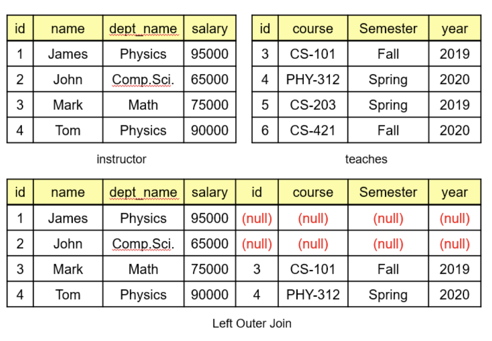

# SQL Join
두 개 이상의 테이블을 연결하여 데이터를 검색할 때 사용 <br/>
테이블 간의 연관관계가 있어야 함
- 일반적으로 PK FK가 있어야 함
- 하지만, 논리적 연관만으로 Join이 가능


## Inner Join
기준 테이블과 조인 테이블 모두에 공통된 데이터가 존재 해야함<br/>
그냥 JOIN을 사용하더라도 INNER JOIN으로 인식
```
SELECT <열 목록>
FROM <첫 번째 테이블>
    INNER JOIN <두 번째 테이블>
    ON <조인 조건>
[WHERE 검색 조건]
```

## Outer Join
한쪽에만 데이터가 존재해도 결과값이 출력됨


```
SELECT <열 목록>
FROM <첫 번째 테이블(LEFT 테이블)>
    <LEFT | RIGHT | FULL> OUTER JOIN <두 번째 테이블(RIGHT 테이블)>
     ON <조인 조건>
[WHERE 검색 조건]

```
- Left Outer Join: 왼쪽 테이블의 모든 값이 출력
```
SELECT *
FROM instructor
    LEFT OUTER JOIN teaches
    ON instructor.id = teaches.id
```


- Right Outer Join: 으론쪽 테이블의 모든 값이 출력
- Full Outer Join: 인쪽 또는 오른쪽의 모든 값이 출력 (MySql에서는 지원하지 않음)
    -> Left Outer Join과 Right Outer Join을 union 하는 방식으로 구현

## Cross Join
한쪽 테이블의 모든 행과 다른 쪽 테이블의 모든 행을 join하는 기능<br/>
Cartesian Product


```
SELECT * 
FROM <첫 번째 테이블>
    CROSS JOIN <두 번째 테이블>
```

## Self Join
```
SELECT x1.columnA, x1.columnB, x2.columnC
FROM Table x1, Table x2
WHERE x1.columnA = x2.columnC
```

