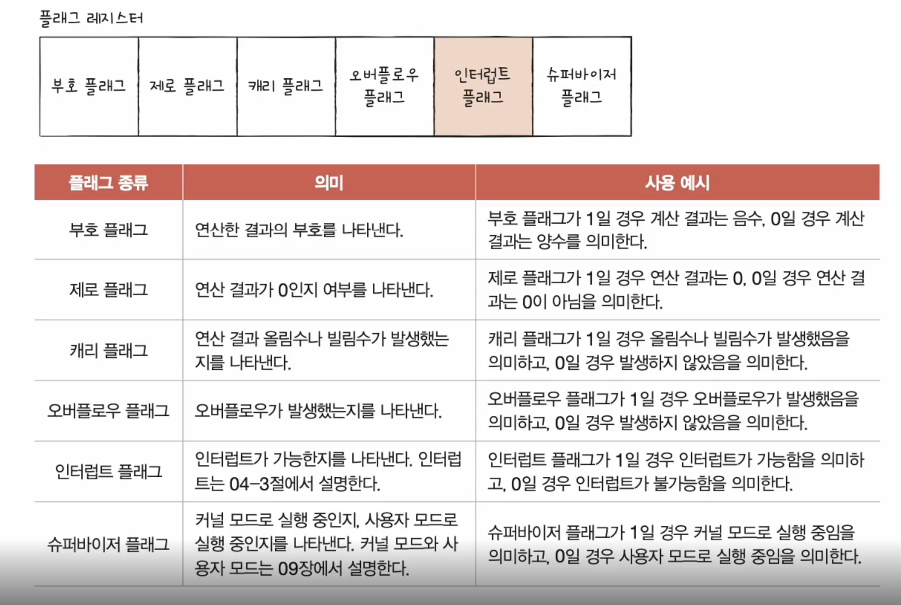
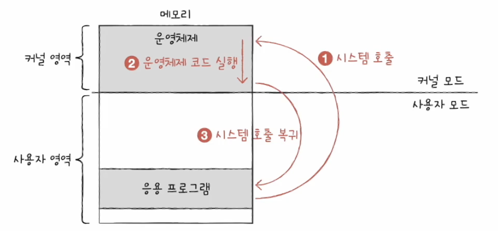

## Kernel

## Types of Operating System

## System Call and Dual Mode
### 이중모드
- CPU가 명령어를 실행하는 모드를 사용자 모드와 커널 모드로 구분하는 방식
- 사용자 모드
  - 운영체제 서비스를 제공받을 수 없는 실행 모드
  - 커널 영역의 코드를 실행할 수 없는 실행 모드
  - 자원 접근 불가
- 커널 모드
  - 운영체제의 서비스를 제공받을 수 있는 실행 모드
  - 자원 접근을 비롯한 모든 명령어 실행 가능 
  

### 시스템 호출
- 커널 모드로 전환하여 실행하기 위해 호출
- 일종의 소프트웨어 인터럽트
   

## Core Services of Operating System
### 프로세스 관리
- 프로세스 == 실행 중인 프로그램
- 수 많은 프로세스들이 동시에 실행

### 자원 접근 및 할당
- CPU
  - CPU 스케줄링: 어떤 프로세스를 먼저, 얼마나 오래 실행할까
- 메모리
  - 페이징
  - 스와핑
- 입출력장치
- 파일 시스템 관리