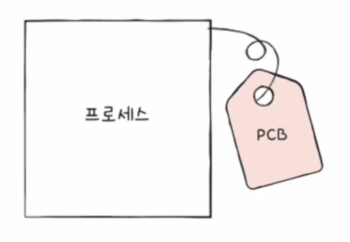
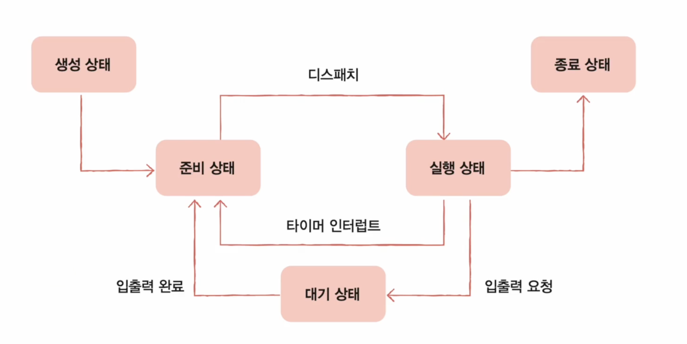
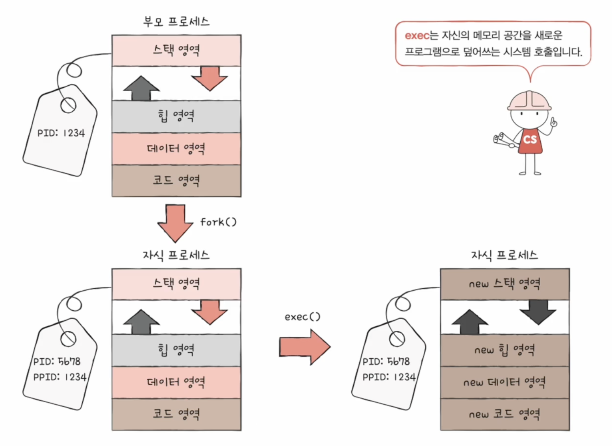
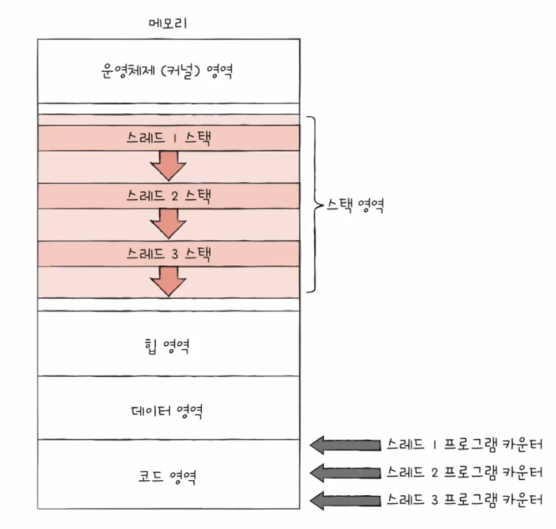
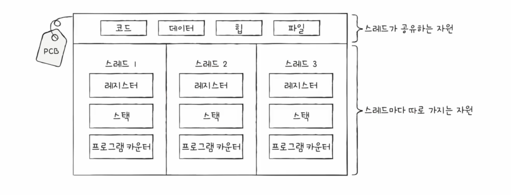

## Process
- foreground process
  - 사용자가 볼 수 있는 공간에서 실행되는 프로세스
- background process
  - 사용자가 볼 수 없는 공간에서 실행되는 프로세스
  - 사용자와 상호작용 하지 않고 정해진 일만 수행하는 프로세스 --> `daemon / service`
> 모든 프로세스는 실행을 위해 CPU가 필요. 
> 하지만 CPU 자원은 한정적 
### 프로세스 제어 블록
- 프로세스들은 돌아가며 한정된 시간 만큼만 CPU 이용
  - 자신의 차례에 정해진 시간만큼 CPU 이용
  - 타이머 인터럽트 (timeout interrupt)가 발생하면 차례 양보
- 빠르게 번갈아 수행되는 프로세스 관리
- 프로세스 제어 블록 (Process Control Block, PCB)
  - 프로세스 관련 정보를 저장하는 자료구조
  - 마치 상품에 달린 태그와 같은 정보
  - 프로세스 생성 시 **커널 영역**에 생성, 종료 시 폐기
   
    
- PCB에 담기는 대표적 정보
  - 프로세스 ID (=PID)
    - 특정 프로세스를 식별하기 위해 보여하는 고유한 번호
  - 레지스터 값
    - 프로세스는 자신의 실행 차례가 오면 이전까지 사용한 레지스터 중간 값을 모두 복원 -> 실행 재게
    - 프로그램 카운터, 스택 포인터 ...
  - 프로세스 상태
  - CPU 스케줄링 정보
  - 메모리 정보
    - 프로세스가 어느 주소에 저장되어 있는지에 대한 정보
    - 페이지 테이블 정보
  - 사용한 파일과 입출력 장치 정보

### Context Switching
- 한 프로세스에서 다른 프로세스로 실행 순서가 넘어감
- 기존에 실행되던 프로세스의 지금까지 중간 정보 백업
  - 프로그램 카운터 등 레지스터 값, 메모리 정보, 열었던 파일, 사용한 입출력 장치 등
  - == 문맥 (context)
  - 뒤이어 실행할 프로세스의 문맥을 복구
- 캐시 메모리 초기화 같은 무거운 작업 시 오버헤드 발생 가능성 존재

### 프로세스의 메모리 영역
- 코드 영역 (=텍스트 영역)
  - 기계어로 이루어진 명령어
  - 데이터가 아닌 CPU가 실행할 명령어, **read-only**
- 데이터 영역
  - 프로그램이 실행되는 동안 유지할 데이터를 저장 (e.g. 전역변수)
- 힙 영역
  - 프로그래머가 직접 할당할 수 있는 저장공간
  > 사용자가 메모리 사용을 지정했으면 언젠가 반환해야 함 
  >> 이것을 언어가 자체적으로 해주는 것이 Garbage Collection
- 스택 영역
  - 데이터가 일시적으로 저장되는 공간
  - e.g. 매개 변수, 지역 변수
> 힙 영역과 스택 영역의 크기는 가변적
>> 일반적으로 힙 영역은 낮은 주소 -> 높은 주소 할당 
>> 일반적으로 스택 영역은 높은 주소 -> 낮은 주소 할당

## Process State and Hierarchy
### 프로세스 상태

- 생성
  - 메모리에 적재되어 PCB를 할당 받은 상태
- 준비
  - CPU를 항당 받아 실행할 수 있으나,
  - 차례가 아니어서 기다리는 상태
  - 실행 상태로 되는 것 -> dispatch
- 실행
  - CPU를 할당 받아 실행 중인 상태
  - 할당된 시간 모두 사용 시 (타이머 인터럽트) 준비 상태가 됨
  - 실행 도중 입출력장치를 사용하면 해당 작업이 끝날 때까지 대기 상태가 됨
- 대기 (blocked state)
  - 프로세스 실행 중 입출력 장치 사용하는 경우
  - 입출력 장치의 속도가 CPU 처리 속도보다 현저히 느림
  - 입출력 작업 종료 시 (입출력 완료 인터럽트 수신 시) 준비 상태가 됨
- 종료 (terminated state)
  - PCB, 프로세스의 메모리 영역 정리

### 프로세스 계층 구조
- 프로세스 실행 도중 시스템 호출을 통해 다른 프로세스 생성 가능
- 부모 프로세스: 새 프로세스를 생성한 프로세스
- 자식 프로세스: 부모 프로세스에 의해 생성된 프로세스
> - 부모와 자식 프로세스는 별개 이기때문에 각기 다른 PID를 가짐 (같은 프로그램을 실행했다 하더라도!) 
> - 일부 운영체제에서는 자식 프로세스 PCB에 부모 프로세스 PID(PPID)를 명시하기도 함
- 자식 프로세스는 또 다른 자식 프로세스를 낳을 수 있음(계속적으로 가능)

### 프로세스 생성 기법
- 부모 프로세스는 자식 프로세스를 어떻게 만들어내고,
- 자식 프로세스는 어떻게 자신만의 코드를 실행할까

- 부모 프로세스는 **fork 시스템 호출**을 통해 자신의 복사본을 자식 프로세스로 생성
- 자식 프로세스는 **exec 시스템 호출**을 통해 자신의 메모리 공간을 다른 프로그램으로 교체
  - 코드/데이터 영역은 실행할 프로그램 영역

## Thread
- 프로세스를 구성하는 실행 흐름의 단위
- 하나의 프로세스는 하나 이상의 스레드를 가질 수 있음
- 구성 요소
  - 스레드 ID
  - 레지스터 값 (프로그램 카운터 등)
  - 스택
  - 실행에 필요한 최소한의 정보 

### 멀티 프로세스 && 멀티 스레드
- 멀티 프로세스
  - 프로세스 fork 시 코드/데이터/힙 영역 등 모든 자원이 복제되어 저장됨
  - 메모리 주소를 제외한 모든 것이 동일한 프로세스가 통째로 메모리에 적재
    - 통째로 중복 저장하지 않으면서 동시에 프로세스끼리 자원을 공유하지 않는 방법도 있음 -> copy on write

- 멀티 스레드

  
- 프로세스 간은 자원을 공유하지 않는다 -> 독립적으로 실행
  - 자원을 주고 받을 수 있다: 프로세스 간 통신 (IPC)
  - 파일을 통한 프로세스 간 통신, 공유 메모리를 통한 프로세스 간 통신
- 스레드는 프로세스의 자원을 공유한다 -> 협력과 통신에 유리
> 하나의 스레드에 문제 발생 시 전체 프로세스에 문제가 생길 수 있음  
> -> `Critical Section 기법: 상호배제, 진행, 한정된 대기`
