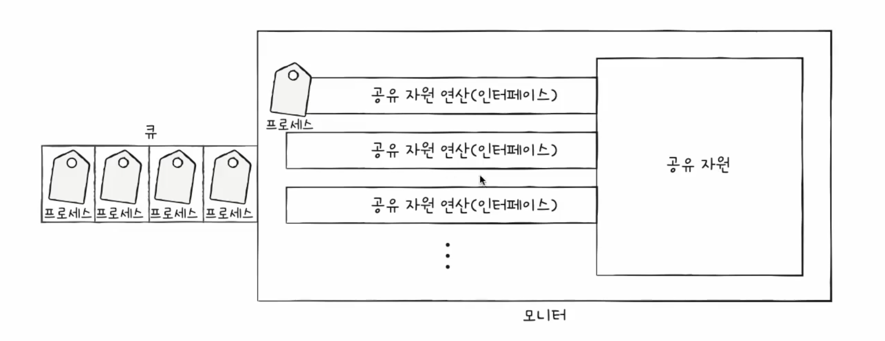
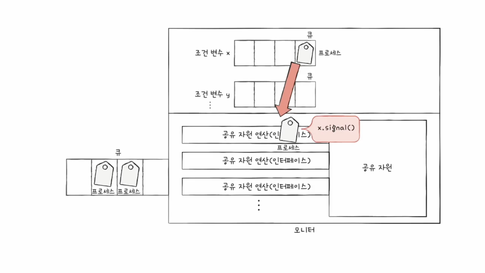

## Synchronization
> 실행의 문맥을 갖는 모든 대상은 동기화 대상 -> 스레드도 동기화 대상임 <br/>
> 편의상 '프로세스'만 지칭할 뿐
- 공동의 목적을 위해 동시에 수행되는 프로세스
  - e.g. 워드 프로세서
    - 맞춤법 검사 프로세스
    - 입력 내용 화면에 출력하는 프로세스 ...
  - 올바른 수행을 위해 동기화 되어야 함 -> 자원의 일관성 보장 필요
- 동기화: 프로세스들의 수행 시기를 맞추는 것
  - **실행 순서 제어**: 프로세서를 올바른 순서대로 실행
  - **상호 배제**: 동시에 접근해서 안되는 자원에 하나의 프로세스만 접근

### 실행 순서 제어를 위한 동기화
- reader writer problem
> writer: book.txt에 값을 저장하는 프로세스<br/>
> reader: book.txt에 값을 읽어들이는 프로세스
- reader는 book.txt에 값이 존재한다는 *특정 조건*이 만족되어야만 실행 가능

### 상호 배제를 위한 동기화
- bank account problem
  - 공유 불가능한 자원의 동시 사용을 피하기 위한 동기화
    > 현재 계좌 10만원<br/>
    > 프로세스 A: 현재 잔액에 2만원을 추가<br/>
    > 프로세스 B: 현재 잔액에 5만원 추가

- producer & consumer problem
    > 물건을 계속해서 생산하는 producer<br/>
    > 물건을 계속해서 소비하는 consumer<br/>
    > '총합' 변수 공유
- 공유자원: 여러 프로세스 혹은 스레드가 공유하는 자원
  - 전역 변수, 파일, 입출력장치, 보조기억장치, ...
- 임계구역: 동시에 실행하면 문제가 발생하는 자원에 접근하는 코드 영역

### race condition 
- 임계 구역에 동시에 접근하면 자원의 일관성이 깨질 수 있다

1. 커널 작업 수행 중 인터럽트 발생
   - 문제점: 커널모드에서 데이터를 로드하여 작업 수행 중 인터럽트가 발생하여 같은 데이터를 조작하는 경우
   - 해결책: 커널모드에서 작업하는 동안, 인터럽트를 disable 시켜 CPU 제어권을 가지지 못하도록 설정
2. 프로세스가 System Call을 하여 커널 모드로 진입하여 작업 수행 중 context switching 발생
   - 문제점: 프로세스1이 커널모드에서 데이터를 조작하는 도중, 시간이 초과되어 CPU제어권이 프로세스2로 넘어가 같은 데이터를 조작하는 경우 (프로세스2가 작업에 반영되지 않음)
   - 해결책: 프로세스가 커널모드에서 작업하는 경우 시간이 초과되어도 CPU 제어권이 다른 프로세스에 넘어가지 않도록 함
3. 멀티 프로세서 환경에서 공유 메모리 내의 커널 데이터에 접근
   - 문제점: 멀티 프로세서 환경에서 2개의 CPU가 동시에 커널 내부 공유 데이터에 접근하여 조작
   - 해결책: 커널 내부에 있는 각 공유 데이터에 접글할 때마다 해당 데이터에 대해 lock/unlock 처리

---
- 상호 배제를 위한 동기화를 위한 세 가지 원칙
  - 상호 배제
    - 한 프로세스가 임계 구역에 진입했다면 다른 프로세스는 들어올 수 없다
  - 진행
    - 임계 구역이 어떤 프로세스도 진입하지 않았다면 진행하고자 하는 프로세스는 들어갈 수 있어야 한다
  - 유한 대기
    - 한 프로세스가 임계구역에 진입하고 싶다면 언젠가는 임게 구역에 들어올 수 있어야 한다 (무한 대기해서는 안된다)
  
### 동기화 기법
#### 스핀 락
```cpp
volatile int lock = 0; //global

void critical() {
	while(test_and_set(&lock) == 1);
	critical section
	lock = 0;
}

// 공유되는 lock에 대해서 원래 가지고 있는 값을 반환
// 반환 하기 전 lock의 값을 무조건 1로 바꿈
int test_and_set(int* lockPtr) {
	int oldLock = *lockPtr;
	*lockPtr = 1;
	return oldLock;
}
```
- test_and_set은 **atomic**한 CPU 명령어
	- 실행 중간에 간섭받거나 중단되지 않음
	- 같은 메모리 영역에 대해 동시에 실행되지 않음
#### 뮤택스 락
  - 락을 가질 수 있을 때까지 휴식
  ```cpp
class Mutex {
	int value = 1; 
	int guard = 0; 
} 

Mutex::lock() {
	// gurad를 취득하기 위한 작업
	// guard가 0이면 1로 바꾸고, 1이면 계속 1을 리턴
	while(test_and_set(&guard));
	
	if(value == 0) { 
		현재 스레드를 큐에 넣는다;
		guard = 0; & go to sleep 
		} else { 
			value = 0: 
			guard = 0; 
		} 
}

Mutex::unlock() {
	while(test_and_set(&guard));
	if(큐 중에 하나 이상 대기 중){
		그 중 하나 깨운다;
	} else {
		value = 1;
	}
	guard = 0;
}
```
	- value: mutex가 잠겼는지 확인 (뮤택스의 핵심 상태를 나타내는 변수)
	- guard: lock의 critical section을 보호 (value가 atmoic할 수 있게 도와주는 임시 락) 

- 참고
	- `while(test_and_set(&guard))`의 Java 식 표현
	- `while(!guard.compareAndSet(false, true))`
```java
compareAndSet(expectedValue, newValue)

guard.compareAndSet(false, true)
```
	- AtmoicBoolean의 메서드 - interrupt되지 않는 하나의 연산
	- guard = true -> false 반환
	- guard = false -> true 반환 && guard를 true로 바꿈


> 스핀락 vs 뮤택스 락
> - 멀티코어 환경이고
> - critical section 작업이 context switching 보다 빨리 끝난다면 
> - 스핀락이 뮤택스보다 더 이점이 있음

#### 세마포
> signal mechanism을 가진 하나 이상의 process / thread가 critical section에 접근 가능하도록 하는 장치
```cpp
class Semaphore {
	int value = 1;
	int guard = 0;
}

Semaphore::wait() {
	while (test_and_set(&guard));
	if(value == 0) {
		현재 스레드를 큐에 넣음
		guard = 0; & go to sleep
	} else {
		value -= 1;
		guard = 0;
	}
}

Semaphore::signal() {
	while(test_and_set(&guard)); 
	if(큐에 하나 이상 대기중) {
		그 중 하나를 깨워서 준비시킴
	} else {
		value += 1;
	}
	guard = 0;
}
```
- 순서를 정할 때 사용
```cpp
class Semaphore {
	int value = 0;
	int guard = 0;
} 
```
| Process1 | Process 2|
| --- | ---|
|task1| task2|
|semaphore -> signal() | semaphore -> wait()|
| | task3|

- task 3는 task1 이 끝난 뒤에 실행됨
- wait() 와 signal()이 같은 프로세스에서 실행될 필요는 없음

#### 뮤택스와 바이너리 세마포
- 뮤택스는 락을 가진 자만 락을 해제할 수 있음
- 세마포는 signal()의 주체와 wait()의 주체가 다를 수 있음
- 뮤택스는 priority inheritance 속성을 가짐
	- CPU scheduling에서 하나의 프로세스가 다른 프로세스를 의존할 때
	- 우선순위가 높은 프로세스가 낮은 프로세스를 의존하고 있다면
	- 우선순위가 낮은 프로세스의 순위를 높이는 방식 -> priority inheritance
- 상호 배제만 필요하다면 뮤택스
- 작업 간 실행 순서 동기화가 필요하다면 세마포가 권장됨

#### 세마포 - 과거 공부 내용
  - 이진 세마포, **카운팅 세마포**
  - 공유 자원이 여러 개 있는 경우에도 가능
  - 임계 구역 앞에서 멈춤 신호를 받으면 잠시 기다리기
  - 임계 구역 앞에서 가도 좋다는 신호를 받으면 임계 구역 진입
  > - 전역변수 하나<br/>
  > - 함수 두개<br/>
  >> 임계 구역에 진입할 수 있는 프로세스 개수를 나타내는 전역변수 S<br/>
  >> 임계 구역에 들어가도 좋은지 기다리는 wait 함수<br/>
  >> 임계 구역 앞에서 기다리는 프로세스에 가도 좋다는 신호 주는 signal 함수
  ```cpp
  wait(){
    while (S <= 0);
    S--;
  }

  signal() {
    S++;
  }
  ```
  - 세마포의 변수 S를 0으로 두고
  - 먼저 실행할 프로세스 뒤에 signal()
  - 다음에 실행할 프로세스 앞에 wait()
- 모니터
  - 매번 임계구역 앞 뒤로 wait(), signal() 호출 -> 실수 가능성이 높음
  - 상호 배제를 위한 동기화
    - 인터페이스를 위한 큐
    - 공유 자원에 접근하고자 하는 프로세스를 인터페이스를 위한 큐에 삽입
    - 큐에 삽입된 순서대로 한번에 하나의 프로세스만 공유 자원 이용
    
  - 실행 순서 제어를 위한 동기화
    - 조건 변수를 이용
      - 프로세스나 스레드의 실행 순서를 제어하기 위해 사용되는 특별한 변수
    - 조건 변수에 대한 큐 (상호배제를 위한 큐와 다름)
    
    