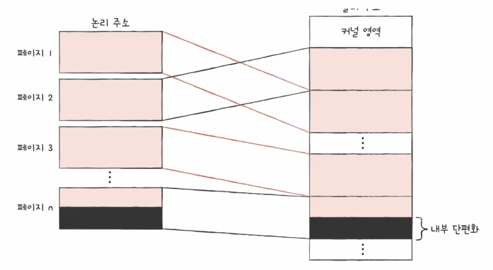
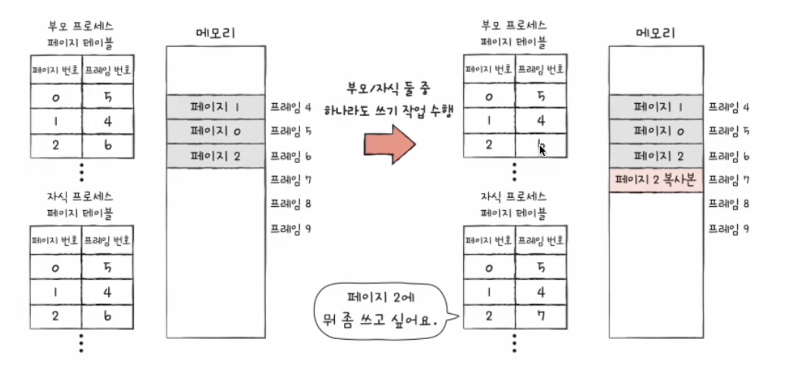
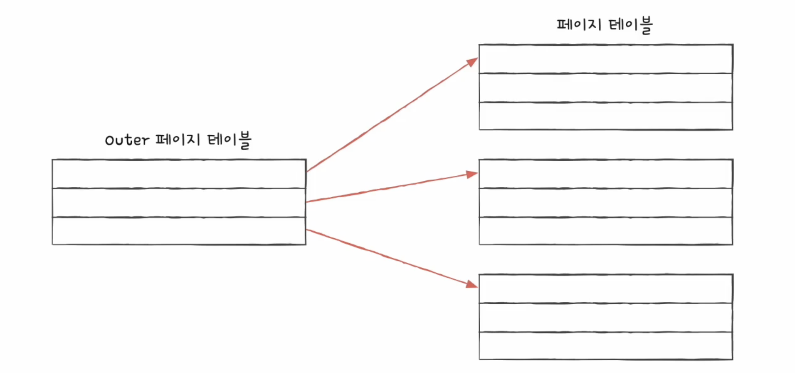

## Contiguous Memory Allocation
- 프로세스에 연속적인 메모리 공간을 할당
### 스와핑
- 현재 사용되지 않는 프로세스들을 보조기억장치의 일부 영역으로 쫒아내고 (스왑 아웃)
- 새로운 빈 공간에 새 프로세스 적재 (스왑 인)

### 메모리 할당
> 프로세스는 메모리의 빈 공간에 할당 되어야 함 -> 빈 공간이 여러 개 라면
- 최초 적합 (first-fit)
  - 검색 최소화, 빠른 할당
- 최적 적합 (best-fit)
  - 빈 공간을 모두 검색 뒤 적재 가능한 가장 작은 공간에 할당
- 최악 적합 (worst-fit)
  - 빈 공간을 모두 검색 뒤 적재 가능한 가장 큰 공간에 할당

### 외부 단편화
> - 프로세스들이 실행되고 종료되길 반복하며 메모리 사이 사이에 빈 공간 발생
> - 프로세스를 할당히기 어려울 만큼 작은 메모리 공간들이 발생 -> 메모리 낭비

해결책
- 메모리 압축 (compaction)
  - 흩어져 있는 빈 공간들을 하나로 모으는 방식
  - 프로세스를 재배치 하는 과정에서 오버헤드 발생
- 페이징

## Paging
> - 가상 메모리
>  - 실행하고자 하는 프로그램을 일부만 메모리에 적재하여 실제 물리 메모리 크기보다 더 큰 프로세스를 실행할 수 있게 하는 기술
> - 외부 단편화의 근본 문제
>   - 각기 다른 크기의 프로세스가 메모리에 `연속적으로` 할당되었기 때문

- 프로세스를 일정 크기로 자르고, 이를 메모리에 불연속적으로 할당
  - 프로세스의 논리 주소 공간을 **페이지(page)**의 단위로 자르고
  - 메모리의 물리 주소 공간을 **프레임(frame)**이라는 페이지와 동일한 일정 단위로 자른 뒤
  - 페이지를 프레임이 할당
- 페이징에서의 스와핑
  - 페이지 인, 페이지 아웃
- 문제점
  - 프로세스를 이루는 페이지가 어느 프레임에 적재되어 있는지 CPU가 알기 어려움
  - 프로세스가 메모리에 불연속적으로 배치되어 있다면 CPU가 순차적으로 실행할 수 없음
  - CPU가 `다음에 실행할 명령어 위치`를 찾기 어려움

### 페이지 테이블
- 페이지 번호와 프레임 번호를 짝지어 주는 일종의 이정표
- 프로세스마다 페이지 테이블이 존재
- 내부 단편화
  - 프로세스 크기가 페이지 크기의 배수 단위가 아닐 때
  > - i.e. 페이지 크기 10KB, 프로세스 크기 108KB
  > - 11번째 페이지는 8KB만 적재 (2KB 내부 단편화)
  

#### PTBR (Process Table Base Register)
- 프로세스마다 페이지 테이블이 있고
- 각 페이지 테이블은 CPU 내의 프로세스 테이블 베이스 레지스터가 가리킴
- 페이지 테이블이 메모리에 저장되어 있다면 메모리 접근 시간이 두배가 됨
- TLB: CPU 곁에 페이지 테이블의 캐시 메모리
  - 페이지 테이블의 일부를 가져와 저장
  - CPU가 접근하려는 논리 주소가 TLB에 있다면 `TLB 히트`
  - CPU가 접근하려는 논리 주소가 TLB에 없다면 `TLB 미스` -> 메모리 접근 두 번

#### 페이징에서 주소 변환
- 특정 주소에 접근하고자 한다면
  - 어떤 페이지/프레임에 접근하고 싶은지
  - 주소가 페이지/프레임에서 얼마나 떨어져 있는지
- 페이징 시스템에서의 논리 주소
  - 페이지 번호 (page number)
  - 변위 (offset)

#### 페이지 테이블 엔트리
- 유효 비트
  - 현재 해당 페이지에 접근 가능한지 여부
  - 메모리에 적재되어 있는지 여부
  - 유효 비트가 0인 페이지에 접근하려고 하면
  - 페이지 폴트(page fault) 인터럽트 발생
    > 1. CPU는 기존 작업 내용을 백업
    > 2. 페이지 폴트 처리 루틴 실행
    > 3. 페이지 처리 루틴은 원하는 페이지를 메모리로 가져온 뒤 유효 비트를 1로 변경
    > 4. 페이지 폴트 터리 후 CPU가 해당 페이지 접근
- 보호 비트
  - r(read) / w(write) / x(execute)
- 참조 비트
  - CPU가 이 페이지에 접근한 적이 있는지 여부
- 수정 비트(dirty bit)
  - CPU가 페이지에 데이터를 쓴 적이 있는지 여부 (변경 여부)
  - 스왑 아웃 시 보조기억장치에 쓰기 작업 여부 판단

## Copy-on-Write && Hierarchical Paging
### 쓰기 시 복사
> - 이론적인 fork()
>   - 프로세스는 기본적으로 자원을 공유하지 않음
>   - 부모 프로세스가 적재된 별도의 공간에 자식 프로세스가 통째로 복사되어 적재
- fork가 되면 자식 프로세스는 부모 프로세스와 동일한 프레임을 가리킴
- 부모/자식 프로세스 중 하나가 페이지에 쓰기 작업 수행 시 해당 페이지는 별도의 공간으로 복제
 

 ### 계층적 페이징
 
 - 페이지 테이블을 페이징하여 여러 단계의 페이지를 두는 방식
 - 모든 페이지 테이블이 항상 메모리에 있을 필요는 없음
 - CPU와 가장 가까이 위치한 페이지 테이블`(Outer 페이지 테이블)`은 항상 메모리에 유지
 - 레벨이 깊어졌을 경우, page fault 시 메모리 참조해야 하는 횟수가 많아짐

## Page Replacement && Frame Allocation
### 요구 페이징 (demand paging)
- 처음부터 모든 페이지를 적재하지 않고 필요한 페이지만 메모리에 적재하는 기법
  1. CPU가 특정 페이지에 접근하는 명령어 실행
  2. 해당 페이지 유효 비트가 1일 경우 (현재 메모리에 있을 경우) CPU가 프레임에 접근
  3. 유효비트가 0일 경우 페이지 폴트 발생
  4. 페이지 폴트 처리 루틴은 해당 페이지를 메모리로 적재하고 유효 비트 1로 설정
  5. 1번 수행

### 페이지 교체 알고리즘
> - 요구 페이징 기법으로 페이지들을 적재하다보면 언젠가 메모리가 가득 차게 됨
> - 어떤 페이지를 보조기억장치로 내보낼 지 결정하는 방법
> - 좋은 페이지 교체 알고리즘 -> 페이지 폴트가 적은 알고리즘
>   - 페이지 폴트가 발생하면 보조기억장치에 접근하면서 성증이 저하됨
> - 페이지 참조열(page reference string)
>   - CPU가 참조하는 페이지들 중 연속된 페이지를 생략한 페이지열

- FIFO
  - 메모리에 가장 먼저 올라온 페이지부터 내쫓는 방식
  - `프로그램 실행 내내 사용될 페이지를 쫓아내서는 안됨`
- Second-chance (FIFO 보완책)
  - 참조 비트 1: CPU가 한 번 참조한 적 있는 페이지 -> 기회 한번 더 주기
  - 참조 비트 0: CPU가 참조한 적 없는 페이지 -> 내쫓기
- OPT (최적 페이지 교체)
  - CPU에 의해 참조되는 횟수를 고려
  - 메모리에 없어도 될 페이지는 오랫동안 사용되지 않을 페이지
  - 예측에 어려움 -> 실제 구현이 어려움
- LRU Least-Recently-Used
  - 가장 오래 사용되지 않은 페이지 교체

### Thrashing
- 각 프로세스가 필요로 하는 최소한의 프레임 수가 보장되지 않음
- `각 프로세스가 필요로 하는 최소한의 프레임 수를 파악하고 적절한 프레임을 할당해주어야 함`

### 프레임 할당
#### 정적 할당
- 균등 할당
- 비례 할당
  - 프로세스 크기에 비례하여 할당
#### 동적 할당
- working set
  - CPU가 특정 시간 동안 주로 참조한 페이지 개수만큼만 프레임 할당
  - 작업 집합: 실행 중인 프로세스가 일정 시간 동안 참조한 페이지의 집합
- PFF
  - 페이지 폴트율이 너무 높으면 프로세스는 너무 적은 프레임을 갖고 있음
  - 페이지 폴트율이 너무 낮으면 프로세서는 너무 많은 프레임을 갖고 있음
  - 페이지 폴트율에 상한선&&하한선 설정 후 그 내부 범위에서만 프레임을 할당
