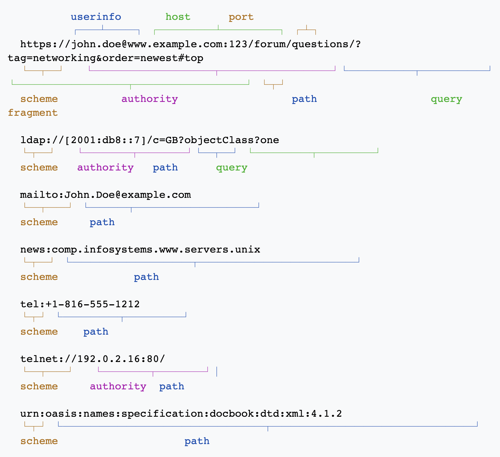

## 브라우저 동작 방법

### 브라우저 주요 기능
`사용자가 선택한 자원을 서버에 요청하여 브라우저에 표시`
- 자원: html문서, pdf, image 등
- 주소: URI에 의해 정해짐
- URI: Uniform Resource Identifier
  - 논리적/물리적 자원을 확인하는 고유한 문자열의 집합
    ```
    # URI 구조
    URI = scheme ":" ["//" authority] path ["?" query] ["#" fragment]

    # authority
    authority = [userinfo "@"] host [":" port]
    ```
    

- URL: Uniform Resource Locator
  - 식별자 + 위치 (프토토콜 + 이름)
  - URI의 부분집합 개념

### 브라우저 기본 구조
- 사용자 인터페이스: 요청한 페이지를 보여주는 창을 제외한 나머지 부분(주소 표시줄, 이전/다음 버튼 등)
- 브라우저 엔진: 사용자 인터페이스와 렌더링 엔진 사이의 동작 제어
- 렌더링 엔진: 요청한 콘텐츠 표시
- 통신: http 요청 등 네트워크 호출에 사용
- UI 백엔드: 플랫폼에서 명시하지 않은 일반적 인터페이스. 콤보 박스 같은 기본적 장치
- 자바스크립트 해석기: 자바스크립트 코드 해석&실행
- 자료 저장소: 쿠키 등 모든 종류 자원을 하드 디스크에 저장

### 렌더링
기본적으로 html, xml 문서, 이미지 표시
추가로 플러그인이나 브라우저 확장 기능으로 pdf등 다른 유형 표시 가능
- 렌더링 엔진 종류
  - 크롬, 사파리: Webkit 엔진
  - 파이어폭스: Gecko 엔진

- 렌더링 동작 과정<br/>


```
1. html 문서 파싱
2. 콘텐츠 트리 내부에서 태그를 모두 DOM 노드로 변환
3. 외부 CSS 파일과 함께 포함된 스타일 요소 파싱
4. 스타일 정보 & html 규칙 -> 렌더 트리 생성
5. 렌더 트리가 정해진 순서로 화면에 표시
6. UI 백엔드에서 렌더 트리의 각 노드를 가로질러 형상 만듦 (그리기 과정)
7. 모든 html을 파싱할 때까지 기다리지 않고 화면에 표시 (화면이 한꺼번에 뜨지 않음)
```
- DOM
  - Document Object Model
  - `<html>, <body>`같은 태그를 javascript가 활용할 수 있는 객체로 만드는 것
  - 모델: 모듈화로 만들었다가 객체를 인식
- 파싱
  - 브라우저가 코드를 이해하고 사용할 수 있는 구조로 변환하는 것
  - 문서를 통해 어휘 분석&구문 분석 과정을 거쳐 파싱 트리 구축 (컴파일)
  - 파싱 트리를 기계코드 문서로 변환시키면 최종 결과물 도출
    - 파서 생성기 flex / bison 등을 이용 (웹킷)